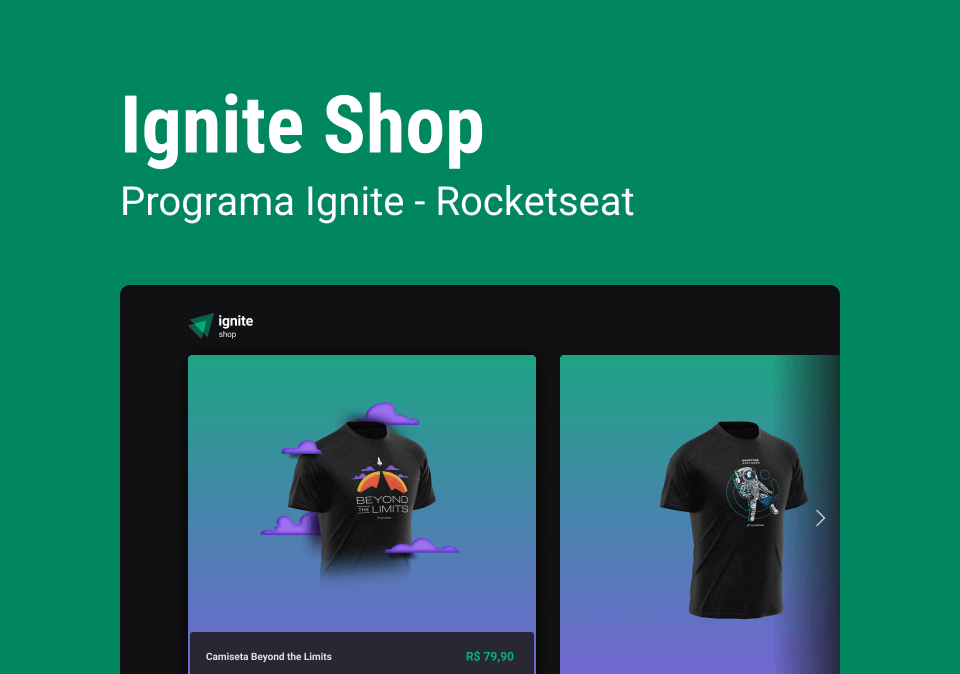
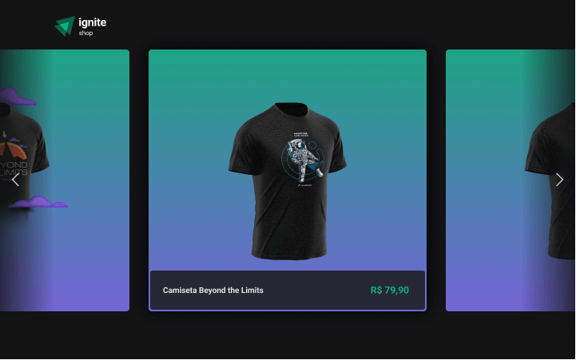
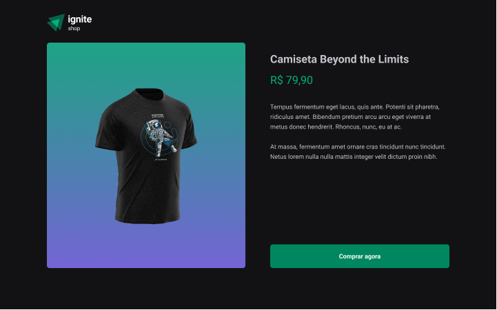

<h1 align="center">
  
</h1>

<h4 align="center">
  Ignite Shop - Concluded 🚀
</h4>

<p align="center">
 <a href="#-about-the-project">About</a> •
 <a href="#-functionalities">Functionalities</a> •
 <a href="#-layout">Layout</a> •
 <a href="#-how-to-run-the-project">How to run</a> •
 <a href="#-technologies">Technologies</a> •
 <a href="#-author">Author</a> •
 <a href="#user-content--license">License</a>
</p>

## 💻 About the project

Project in ReactJS developed with Next.js.
This is a product carousel project in an e-commerce where it is possible to simulate the purchase of products through an integration API.

Project developed during the **Ignite Program** on the ReactJS track taught by [Rocketseat](https://www.rocketseat.com.br/).

---

## ⚙️ Functionalities

- [x] Users can:
  - [x] Browse a product carousel;
  - [x] Simulate buying products;
  - [x] View additional information for each product;
  - [x] Fill out a real purchase form.

---

## 🎨 Layout

The application layout is available in Figma:

<a href="https://www.figma.com/file/UNGoKaHRIl4K0m94utc0ok/Ignite-Shop">
  
</a>

### Web

<div style="display: flex; flex-direction: column; align-items: center; justify-content: center; gap: 10px">
  

  
</div>

---

## 🚀 How to run the project

This is a frontend project.

### Prerequisites

Before starting, you will need to have the following tools installed on your machine:
[Git](https://git-scm.com), [Node.js](https://nodejs.org/en/).
Also it's nice to have an editor to work with the code like [VSCode](https://code.visualstudio.com/).

#### 🧭 Running the web application (Frontend)

```bash

# Clone this repository
$ git clone git@github.com:yuricavalini/ignite-shop.git

# Access the project folder in your terminal/cmd
$ cd ignite-shop

# Install the dependencies
$ npm install

# Run the application in development mode
$ npm run dev

# The application will open on port:3000 - go to http://localhost:3000

```

---

## 🛠 Technologies

Main tools used in the construction of the project:

#### **Website**  ([React](https://reactjs.org/)  +  [TypeScript](https://www.typescriptlang.org/))

- **[Next.js](https://nextjs.org/)**
- **[Keen-Slider](https://keen-slider.io/)**
- **[Axios](https://axios-http.com/)**
- **[Stitches](https://stitches.dev/)**
- **[Stripe](https://github.com/stripe/stripe-node)**

> See the full file [package.json](https://github.com/yuricavalini/ignite-shop/blob/master/package.json)

**Utilities**

- Prototype:  **[Figma](https://www.figma.com/)**  →  **[Prototype (Ignite-Shop)](https://www.figma.com/file/UNGoKaHRIl4K0m94utc0ok/Ignite-Shop)**
- Standardization of project and code: **[Eslint](https://eslint.org/)** - **[Commit-msg-linter](https://github.com/legend80s/commit-msg-linter)** - **[Husky](https://typicode.github.io/husky/#/)** - **[Lint-staged](https://github.com/okonet/lint-staged)** - **[EditorConfig](https://editorconfig.org/)**
- Editor:  **[Visual Studio Code](https://code.visualstudio.com/)**

---

## 🧑🏻‍💻 Author

<div align="center">
  <a href="https://github.com/yuricavalini">
  
  <br />
  <sub><b>Yuri Cavalini</b></sub></a> <a href="https://github.com/yuricavalini" title="Yuri Cavalini">🚀</a>
  <br />
  </a>
</div>
<br />
<div align="center">
  <a title="yuricavalini@gmail.com" href="mailto:yuricavalini@gmail.com?subject=Contact" target="_blank">
    
  </a>
  <a href="https://discordapp.com/users/9585" target="_blank">
    
  </a>
  <a href="https://linkedin.com/in/yuricavalini" target="_blank">
    
  </a>
</div>

---

## 📝 License

This project is licensed under the [MIT](./LICENSE) license.

Made with ❤️ by Yuri Cavalini 👋🏻 [Contact me!](https://www.linkedin.com/in/yuricavalini/)
